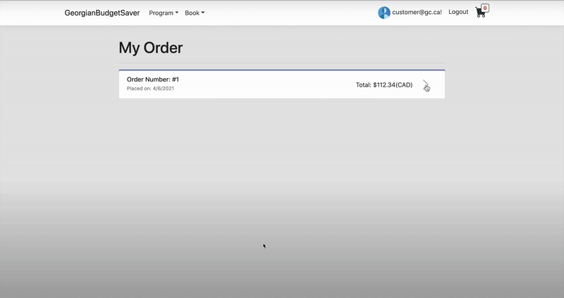

# ASP.NET Core
- Yi-Tzneg Chen
# Purpose:
I will make a web application for students who study in Georgian College to sell their used
textbooks. It is important how to save money when studying because we will need to buy course
material for some courses. Not every student has access to new book, so they can buy used books to
control their budget. In the app, I will organize books by programs so that people can easily and
efficiently look for their items.
# Value:
The first thing that we think of used books is saving budget. Students do not need brand new
textbooks if they will not keep them after graduating. Also, I found that lots of groups online in
Facebook or other social media do not organize them well. It is also hard for students to find what they
want efficiently. Furthermore, we save the planet as well. A new book which will not be purchased
means that lots of energy and plants are saved. Buying used books not only saves our pocket and also
treat our planet friendly.
# Live Link:
https://georgianbudgetsaver.azurewebsites.net (No longer avilable due to outage of credit on Azure)
# Reference:
### CSS Library:
- https://getbootstrap.com/
### Nutget Package:
- https://html-agility-pack.net/
# Demo
## View Order:

